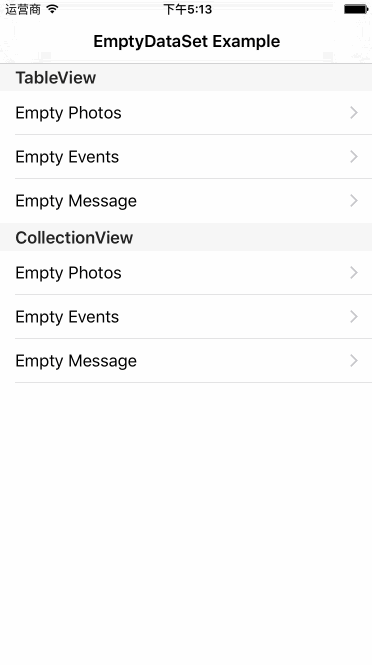

# TBEmptyDataSet
TBEmptyDataSet is an extension of UITableView/UICollectionView's super class, it will  display a placeholder emptyDataSet when the data of tableView/collectionView is empty.

TBEmptyDataSet can be composed of an image, a title and a description, or you can set it as a custom view.





## How To Get Started
### Carthage
Specify "TBEmptyDataSet" in your ```Cartfile```:
```ogdl 
github "teambition/TBEmptyDataSet"
```

### CocoaPods
Specify "TBEmptyDataSet" in your ```Podfile```:
```ruby 
source 'https://github.com/CocoaPods/Specs.git'
platform :ios, '8.0'
use_frameworks!

pod 'TBEmptyDataSet'
```

### Usage
##### 1.  Assign the data source and delegate
```swift
tableView.emptyDataSetDataSource = self
tableView.emptyDataSetDelegate = self
```
##### 2.  Implement the data source and delegate
Data source functions:
```swift 
func imageForEmptyDataSet(in scrollView: UIScrollView) -> UIImage? {
    // return the image for EmptyDataSet
}

func titleForEmptyDataSet(in scrollView: UIScrollView) -> NSAttributedString? {
    // return the title for EmptyDataSet
}

func descriptionForEmptyDataSet(in scrollView: UIScrollView) -> NSAttributedString? {
    // return the description for EmptyDataSet
}

func imageTintColorForEmptyDataSet(in scrollView: UIScrollView) -> UIColor? {
    // return the image tint color for EmptyDataSet
}

func backgroundColorForEmptyDataSet(in scrollView: UIScrollView) -> UIColor? {
    // return the backgroundColor for EmptyDataSet
}

func verticalOffsetForEmptyDataSet(in scrollView: UIScrollView) -> CGFloat {
    // return the vertical offset for EmptyDataSet, default is 0
}

func verticalSpacesForEmptyDataSet(in scrollView: UIScrollView) -> [CGFloat] {
    // return the vertical spaces from top to bottom for EmptyDataSet, default is [12, 12]
}

func titleMarginForEmptyDataSet(in scrollView: UIScrollView) -> CGFloat {
    // return the minimum horizontal margin space for title, default is 15
}

func descriptionMarginForEmptyDataSet(in scrollView: UIScrollView) -> CGFloat {
    // return the minimum horizontal margin space for description, default is 15
}

func customViewForEmptyDataSet(in scrollView: UIScrollView) -> UIView? {
    // return an UIView instance for EmptyDataSet
}
``` 
Delegate functions:
```swift
func emptyDataSetShouldDisplay(in scrollView: UIScrollView) -> Bool {
    // should display EmptyDataSet or not, default is true
}

func emptyDataSetTapEnabled(in scrollView: UIScrollView) -> Bool {
    // enable tap gesture or not, default is true
}

func emptyDataSetScrollEnabled(in scrollView: UIScrollView) -> Bool {
    // scrollView can scroll or not, default is false
}

func emptyDataSetDidTapEmptyView(in scrollView: UIScrollView) {
    // do something
}

func emptyDataSetWillAppear(in scrollView: UIScrollView) {
    // do something
}

func emptyDataSetDidAppear(in scrollView: UIScrollView) {
    // do something
}

func emptyDataSetWillDisappear(in scrollView: UIScrollView) {
    // do something
}

func emptyDataSetDidDisappear(in scrollView: UIScrollView) {
    // do something
}
```
##### 3.  Data source events (inserting, deleting, reloading, etc.)
TBEmptyDataSet will update automatically when the data source of table view or collection view changes.

To be specific:
* For UITableView, it updates when ```endUpdates()``` is called.
* For UICollectionView, it updates when ```performBatchUpdates(_:completion:)``` is completed.
* For both UITableView and UICollectionView, it updates when ```reloadData()``` is called.

## Minimum Requirement
iOS 8.0

## Release Notes
* [Release Notes](https://github.com/teambition/TBEmptyDataSet/releases)

## License
TBEmptyDataSet is released under the MIT license. See [LICENSE](https://github.com/teambition/TBEmptyDataSet/blob/master/LICENSE.md) for details.

## More Info
Have a question? Please [open an issue](https://github.com/teambition/TBEmptyDataSet/issues/new)!
